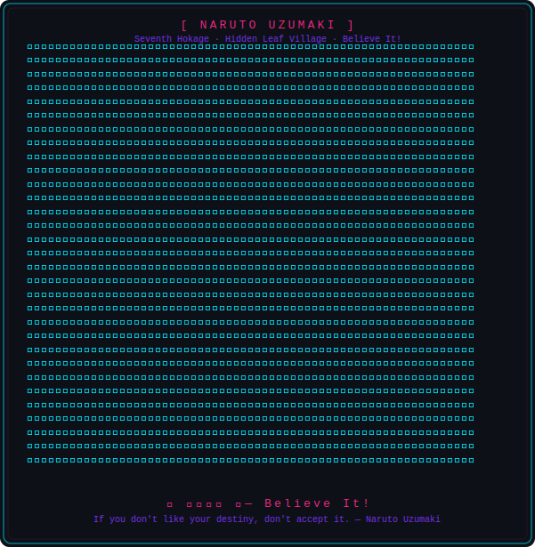
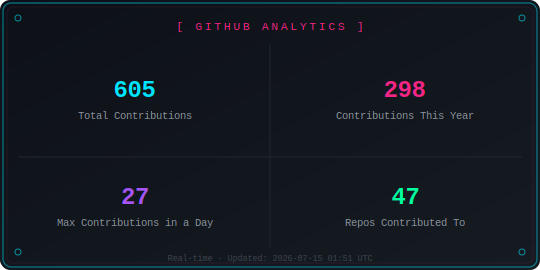
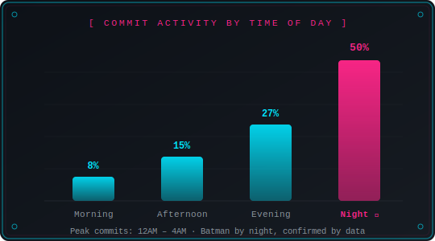

  

 

<table width="100%" border="0" cellspacing="0" cellpadding="0">
  <tr>
    <td width="50%" align="center" valign="middle">
      
    </td>
    <td width="50%" align="center" valign="middle">
      
        
      
      
        
      
      
    </td>
  </tr>
</table>

 

  <!-- ANIME_QUOTE_START -->
  
  <!-- ANIME_QUOTE_END -->

 

  

  

 

  

<table width="100%" border="0" cellspacing="0" cellpadding="16">
  <tr>
    <td width="60%" align="center" valign="middle">
      
    </td>
    <td width="40%" align="center" valign="middle">
      
       
      
       
      <i>Max productivity hits after the sun goes down</i>
    </td>
  </tr>
</table>

 

  

  

 

  

  
  

 

<table width="100%" border="0" cellspacing="0" cellpadding="16">
  <tr>
    <td width="50%" align="center" valign="middle">
      <h3><i>"Domain Expansion : Infinite Bug Ignorance"</i></h3>
    </td>
    <td width="50%" align="center" valign="middle">
      
    </td>
  </tr>
</table>
